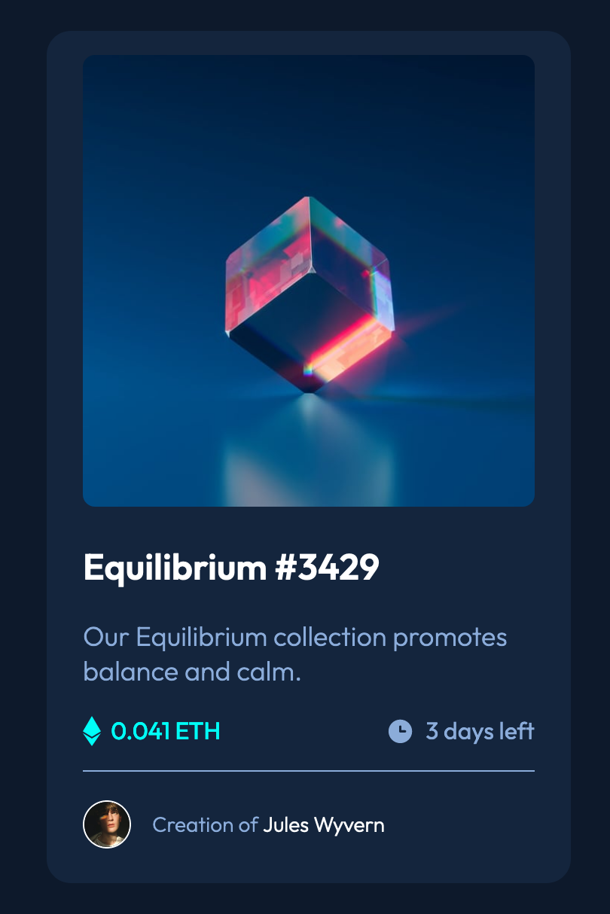

# Frontend Mentor - NFT preview card component solution

This is a solution to the [NFT preview card component challenge on Frontend Mentor](https://www.frontendmentor.io/challenges/nft-preview-card-component-SbdUL_w0U). Frontend Mentor challenges help you improve your coding skills by building realistic projects. 

## Table of contents

- [Overview](#overview)
  - [The challenge](#the-challenge)
  - [Screenshot](#screenshot)
- [My process](#my-process)
  - [Built with](#built-with)
  - [What I learned](#what-i-learned)
- [Author](#author)

## Overview

### The challenge

Users should be able to:

- View the optimal layout depending on their device's screen size
- See hover states for interactive elements

### Screenshot




## My process

### Built with

- Semantic HTML5 markup
- CSS custom properties
- Flexbox

### What I learned

Use sibling selector

```css
.card-image:hover ~ img {
  display: block;
}
```


## Author

- Website - [Thales Gonçalves](https://www.thalesgoncalves.com)
- Frontend Mentor - [@thales-goncalves](https://www.frontendmentor.io/profile/thales-goncalves)
- Twitter - [@thalesgg_](https://www.twitter.com/thalesgg_)

